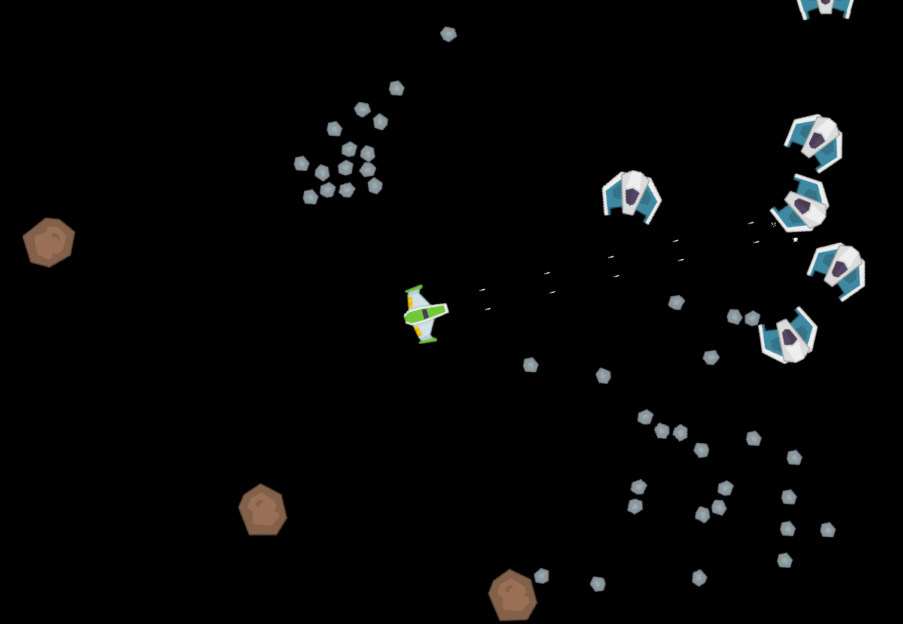

This is a simple space game.\
I am making it in my spare time for fun and learning.\
Feel free to use it as template for your own things.\
\
\
\
Space worlds (game maps) with entities for this game you can create and edit with [moeditor](https://git.sr.ht/~modevstudio/moeditor) project. There you will find also description of the game storage (SQLite database) structure.\
\
You don't have to compile the game to run it, all the necessary release files (for windows) are located in the folder **bin**.\
\
**I am using next tools:**\
\
~ [Odin](https://odin-lang.org/): programming language;\
~ [box2d](https://github.com/erincatto/box2d): for game physics (Odin's vendor lib);\
~ [karl2d](https://github.com/karl-zylinski/karl2d): for graphics and user events;\
~ [moecs](https://sr.ht/~modevstudio/moecs/): entity component system;\
~ [kenney](http://kenney.nl): for assets;\
\
**Implemented features:**\
\
~ Moving forward, backward, left, right, angular.\
~ Extreme (fast) breaking (to full stop).\
~ Increasing/decreasing max speed.\
~ Choose weapon type (one/two bullets for now).\
~ Shots interval (100 ms).\
~ Impulses (for moving) calculates depending on ship mass.\
~ Bullet/asteroid contact (collision) animation.\
\
**Control keys:**\
\
~ 1        - Change weapon to one bullet.\
~ 2        - Change weapon to two bullets.\
~ A        - Move left.\
~ D        - Move right.\
~ Up       - Move forward.\
~ Down     - Move backward.\
~ Left     - Turn left.\
~ Right    - Turn right.\
~ Minus    - Minimize speed.\
~ Plus(=)  - Maximize speed.\
~ Q        - Decrease speed (slowly).\
~ E        - Increase speed (slowly).\
~ Space    - Brake (extreme).\
~ W        - Shoot.\
~ Ctrl+I   - Zoom in.\
~ Ctrl+O   - Zoom out.\
~ Ctrl+F   - Fullscreen on/off.\
~ Esc      - Show menu (game pause) or back to game (Currently unavailable, I will add UI later).\
\
**Related projects:**\
\
[moeditor](https://git.sr.ht/~modevstudio/moeditor): worlds editor for space game;
[moecs](https://git.sr.ht/~modevstudio/moecs): entity component system;

